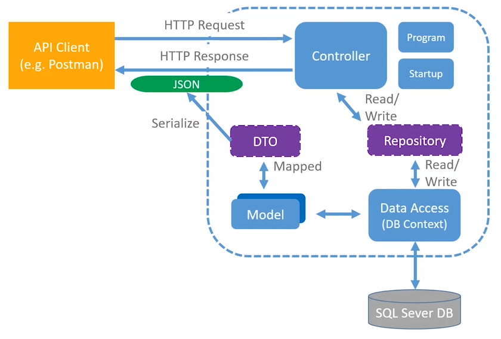

# .NET Core 3.1 MVC REST API

- Author: Les Jackson
- Link: [YouTube](https://www.youtube.com/watch?v=fmvcAzHpsk8)

## Table of Contents

[[TOC]]

## Introduction

### Architecture

- Model - Data (internal)
- Controller - Handles requests and actions
- DB Context - Mediator
- Repository - Introduces Persistence Ignorance
- Data Transfer Objects - Data (external)
- JSON - Payload response (view)



## Coding Part I

### Model

- First step is to create the model, which represents the main data in the application.
  - This just defines the data that your application will use.

```cs
namespace Application
{
  public class Person
  {
    //...
  }
}
```

### Repository

- Create a repository interface for your repositories.
  - This helps decouple implementation details from our contract.
  - You don't implement anything in the interface. You just define what _needs to be in_ an implementation.

```cs
public interface IPersonRepository
{
  IEnumerable<Person> GetAllPersons(); // no implementation details here
}
```

- Once you have your repo interfaces, you create implementations of those.
  - It can be helpful to implement Mocks of these as well, which don't actually connect to a database.
  - Mocks can make testing much easier.

```cs
public interface MockPersonRepository
{
  public IEnumerable<Person> GetAllPersons()
  {
    // implementation details
  }
}
```

- And, when you're ready to create an actual implementation...

### Controller

#### Controller Setup

- Once you have your repositories and models, it's time to create your controllers to interact with those items.
- Create a controller for each of your models.
  - Name is typically the plural of the model plus "Controller".
    - PersonsController, AddressesController, etc.
  - Decorate your controller with the `[ApiController]` attribute.
    - This gives us out-of-the-box behaviors typical for APIs.
  - Also decorate with the controller-level `[Route]`, which defines the base route for all items in the controller.
  - The controller inherits from the `Controller` or `ControllerBase` class.
    - `Controller` implements everything in `ControllerBase` plus Views.
    - If you won't be doing Views, use `ControllerBase`.

```cs
[Route("api/persons")]
[ApiController]
public class PersonsController : ControllerBase
{
  // details
}
```

#### Connecting the Controller to the Repository

- You can instantiate a private readonly property in the Controller that hardcodes your repository connection, but there's a better way.
- By connecting to the interface, instead of a concrete implementation, we can use dependency injection later to plug in the necessary repository.
  - This continues our theme of separating the implementation from the contract, and allows us the flexibility of swapping out the implementation in only one spot.
- In the `ConfigureServices` method, we can specify what the program should do any time someone asks for the repository interface.
  - Add the `services.AddScoped<interface_name, implementation_name>()` to Startup.ConfigureServices.
  - Add a constructor to the controllers that accepts the repository interface and stores it in the private property.
  - Now, when the program runs, it will inject the specified repository in `Startup`.

```cs
// Startup
public void ConfigureServices(IServiceCollection services)
{
  // ...other services
  services.AddScope<IPersonRepository, MockPersonRepository>(); // this will inject the mock repo
}

// PersonsController
[Route("api/persons")]
[ApiController]
public class PersonsController : ControllerBase
{
  private readonly IPersonRepository _repository;

  public PersonsController(IPersonRepository repository)
  {
    _repository = repository ?? throw new System.ArgumentNullException(nameof(repository));
  }
  // other deets.
}
```

##### Dependency Injection

- Dependency injection in .NET Core is handled by the Services Container, which is generated by the `ConfigureServices` method of the `Startup` class.
- In this container, you can define what the system should inject for various things, such as repositories, contexts, etc.

#### Defining API Routes

- Define your routes as public methods that return some kind of `ActionResult`.
  - If they return multiple items, use `ActionResult<IEnumerable<...>>`.
  - For single, return `ActionResult<...>`
- Decorate your methods with the appropriate HTTP code, using `[HttpGet]`, `[HttpPatch]`, etc.
  - You can define the sub-route by passing the route template into the method decorator, or by using the `[Route]` decorator again.
    - In either case, dynamic parameters are passed in within {}.

```cs
[HttpGet("{id}")]
// or
[Route("{id}")]
```

- Write the body of your method, making sure to return the appropriate result.

```cs
[HttpGet]
public ActionResult<IEnumerable<Person>> GetAllPersons()
{
  // stuff
}

[HttpGet("{id}")]
public ActionResult<Person> GetPersonById(int id)
{
  // stuff
}
```

- There are other ways to get data to your controller. This is through binding sources.
  - Here is a [resource](https://docs.microsoft.com/en-us/aspnet/core/mvc/models/model-binding?view=aspnetcore-3.1) on binding sources.

## Coding Part II

- To use packages, add their identifiers to the .csproj file.
  - You can also do it via the dotnet cli.
    - If you don't specify the version, it'll pull the latest.
  - To find the packages, you can look on [nuget](nuget.org). Here, it'll even include the CLI command.

```shell
dotnet add package <package_name>
```

### Entity Framework

- To work with data easily, we can use the EntityFrameworkCore packages.

```shell
dotnet add package Microsoft.EntityFrameworkCore
dotnet add package Microsoft.EntityFrameworkCore.Design
dotnet add package Microsoft.EntityFrameworkCore.SqlServer
```

- We also need the EF tools, so that we can set up migrations, etc.

### DB Context

- Once we have Entity Framework installed, we can create our DbContext.
- The DbContext represents the models down to the database level.
- These extend the `DbContext` class.
- Basically, we create a constructor for the context that passes options up to the base, and add a `DbSet` for our model.

```cs
public class PersonContext {
  public PersonContext(DbContextOptions<Person> options) : base(options) {}

  public DbSet<Person> Persons { get; set; }
}
```

### SQL Server

- To get connected to the server, you can add the `ConnectionStrings` element to `appsettings.json`.
  - Within the `ConnectionStrings` object, enter your connection strings as key-value pairs.

```json
{
  "ConnectionStrings": {
    "PersonConnection": "Server=server_name;Initial Catalog=database_name;User ID=user_id;Password=password;"
  }
}
```

- Then, add the DbContext service to your Startup.ConfigureServices.

```cs
services.AddDbContext<PersonContext>(opt => opt.UseSqlServer(
  Configuration.GetConnectionString("PersonConnection") // this will match what you named your string in the appsettings.json
));
```

- Finally, you can use the dotnet ef tool to create migrations.
  - Just run `dotnet ef migrations add migration_name` and it'll generate what you need.
  - You can undo this by running `dotnet ef migrations remove`.
    - This only removes migrations that haven't been applied.
  - Once ready, you can run the migrations manually from the cli.
    - `dotnet ef database update`
  - Or, you can add it into your Startup to make migrations part of the run step.

### Revisit Repository

- Now it's time to swap out our mock repo for a real one.
- Create a concrete implementation of your repository interfaces.
- Add a constructor to these, and require a parameter of the necessary `DbContext`.
  - Dependency injection will supply this parameter at build.
  - Assign this to a private readonly field.
  - You'll use the `_context` to actually get data from the database.

```cs
public class SqlPersonRepository : IPersonRepository
{
  private readonly PersonContext _context;

  public SqlCommanderRepository(PersonContext context)
  {
    _context = context ?? throw new System.ArgumentNullException(nameof(context));
  }

  public IEnumerable<Command> GetAllCommands()
  {
    return _context.Commands.ToList(); // _context gives us access!
  }

  // other implementation items
}
```

- Finally, swap out the mock repository for the real repository in the `Startup.ConfigureServices`.

```cs
services.AddScoped<IPersonRepository, SqlPersonRepository>(); // bada-bing.
```

## Coding Part III

### Data Transfer Objects (DTOs)

- A DTO extends the concept of decoupling of implementation from contract detail.
  - By directly returning our models, we're exposing all details of these models.
  - A DTO creates a representation of these models that we have more control over.
  - By using a DTO, we can also make changes to our models internally without breaking the contract.

### Automapper

- Automapper automates much of the process of creating DTOs.
  - It's not required, but it's super-helpful.
  - Install it from nuget.
    - AutoMapper.Extensions.Microsoft.DependencyInjection
  - Add it to the Startup class.

```cs
services.AddAutoMapper(AppDomain.CurrentDomain.GetAssemblies());
```

- You'll want to create Profiles to map all of your Dtos to their corresponding Models.
  - Each profile should inherit from the base class of `Profile`.
  - Each profile should include a constructor with no parameters.
  - Within the constructor, you'll use the `CreateMap` method to map between models and Dtos.

```cs
public class PersonProfile : Profile
{
  public PersonProfile()
  {
    CreateMap<Person, PersonDto>();
    // other maps
  }
}
```

- Finally, you'll use the mappings in your controllers to transform the request and response objects.
  - Add a private readonly field, injected through the constructor, for the `IMapper` interface.
  - Instead of returning models, you return the dtos in the return signature.
  - Before returning from the methods, transform them using the \_mapper.Map<dto_name>(model_object) method.

```cs

[Route("api/commands")]
[ApiController]
public class CommandsController : ControllerBase
{
  private readonly ICommanderRepository _repository;
  private readonly IMapper _mapper; // mapper field

  public CommandsController(ICommanderRepository repository, IMapper mapper) // mapper injected
  {
    _repository = repository ?? throw new System.ArgumentNullException(nameof(repository));
    _mapper = mapper ?? throw new System.ArgumentNullException(nameof(mapper)); // mapper assigned
  }

  // GET api/commands
  [HttpGet]
  public ActionResult<IEnumerable<CommandDto>> GetAllCommands() // updated to return dto
  {
    var commandItems = _repository.GetAllCommands();
    return Ok(_mapper.Map<IEnumerable<CommandDto>>(commandItems)); // model mapped to dto in return
  }

  // GET api/commands/{id}
  [HttpGet("{id}")]
  public ActionResult<CommandDto> GetCommandById(int id) // updated to return dto
  {
    var commandItem = _repository.GetCommandById(id);
    if (commandItem != null)
    {
      return Ok(_mapper.Map<CommandDto>(commandItem)); // model mapped to dto in return
    }
    return NotFound();
  }
}
```

### POST

- To add a post route, you need to update your repository interface, your repository implementations, your controllers, and likely add some Dtos.

#### Repository

- Each repository interface, if it's going to allow posting, needs a method related to creating the new resource.
- Each repository also needs a `SaveChanges` method to persist the changes to the database.

```cs
public bool SaveChanges()
{
  return (_context.SaveChanges() >= 0);
}
```

- For posting your data, you can use the context's Add command.

```cs
public void CreatePerson(Person person)
{
  if(person == null)
  {
    throw new System.ArgumentNullException(nameof(person));
  }
  _context.Persons.Add(person);
}
```

#### DbContext

- Through inheritance, the DbContext already has methods for saving changes and adding new resources.
  - `SaveChanges` and `Add`, if you can imagine.
  - So, for these sorts of normal actions, you don't need to do anything to your DbContext.

#### Create Dto

- You'll want to create a Dto for the purpose of creating a new resource.
- It shouldn't include fields that are auto-populated by the database--such as an Id.
- It should include data attributes to control fields.
  - If you fail to do this and the user submits an incomplete request, it'll return a 500 server error instead of a 400 bad request.

```cs
using System.ComponentModel.DataAnnotations;

namespace Person.API.Dtos
{
  public class PersonForCreationDto
  {
    [Required]
    [MaxLength(250)]
    public string FirstName { get; set; }
    [Required]
    public string LastName { get; set; }
    [Required]
    public DateTimeOffset DateOfBirth { get; set; }

  }
}
```

#### Profile

- Along with the new Dto, we need to update our profile mapping to recognize this new mapping.

```cs
CreateMap<PersonForCreationDto, Person>();
```

#### Controller

- In the controller, you'll have to add a route for the create, using the `HttpPost` decorator.
- Don't forget to return the `CreatedAtRoute` object.
  - In order for this to work, you'll have to give the related route a nickname.
  - [Documentation](https://docs.microsoft.com/en-us/dotnet/api/system.web.http.apicontroller.createdatroute?view=aspnetcore-2.2)

```cs
[HttpGet("{id}", Name="GetPersonById")] // here's the nickname
// ... get method

[HttpPost]
public ActionResult<CommandDto> CreateCommand(CommandForCreationDto commandForCreation)
{
  var commandModel = _mapper.Map<Command>(commandForCreation);
  _repository.CreateCommand(commandModel);
  _repository.SaveChanges();
  var commandDto = _mapper.Map<CommandDto>(commandModel);
  return CreatedAtRoute(
    nameof(GetCommandById), // get route nickname
    new { id = commandDto.Id }, // get route parameters
    commandDto
  );
}
```

## Coding Part IV

### PUT

#### Repository

- Add the update method to your interface and implementations.
  - Because of the way DbContexts work, you don't actually have to add content to your implementation for update. Just implement an empty method for it.

#### Dtos

- Create a Dto for the update process.

#### Profile

- Add mapping from your Dto to your model.

#### Controller

- Create your `[HttpPut]` method.

```cs
[HttpPut("{id}")]
public IActionResult UpdateCommand(int id, CommandForUpdateDto commandForUpdate)
{
  var commandModelFromRepo = _repository.GetCommandById(id);
  if (commandModelFromRepo == null) return NotFound();
  _mapper.Map(commandForUpdate, commandModelFromRepo); // this actually calls the update method...
  _repository.UpdateCommand(commandModelFromRepo); // ... but we still call update explicitly so that if we ever change implementations, our system doesn't break.
  _repository.SaveChanges();
  return NoContent();
}
```

### PATCH

- In order to use patch in .NET, we need to add some packages.
  - Microsoft.AspNetCore.JsonPatch
  - Microsoft.AspNetCore.Mvc.NewtonsoftJson
- In addition, we need to update the `Startup` class to use the Newtonsoft package.
  - In ConfigureServices, we need to add NewtonsoftJson and configure it to handle contracts.

```cs
services.AddControllers().AddNewtonsoftJson(s =>
{
  s.SerializerSettings.ContractResolver = new CamelCasePropertyNamesContractResolver();
});
```

#### Profiles

- We need to add a mapping from our model to our update Dto.

```cs
CreateMap<Person, PersonForUpdateDto>();
```

#### Controller

- Here, we have to do a number of things.
  - Create the route using the `[HttpPatch]` decorator.
  - The route should take an id and the patchDoc.
  - We check if the resource exists.
  - We map the resource from the database to an update Dto.
  - We apply the patchDoc to the update Dto.
  - We make sure the patch applied successfully using `ModelState`.
  - We map the update Dto to the model.
  - We update the resource and save.

```cs
[HttpPatch("{id}")]
public IActionResult PartialUpdateCommand(int id, JsonPatchDocument<CommandForUpdateDto> patchDoc)
{
  var commandModelFromRepo = _repository.GetCommandById(id);
  if (commandModelFromRepo == null) return NotFound();
  var commandToPatch = _mapper.Map<CommandForUpdateDto>(commandModelFromRepo);
  patchDoc.ApplyTo(commandToPatch, ModelState);
  if (!TryValidateModel(commandToPatch)) return ValidationProblem(ModelState);
  _mapper.Map(commandToPatch, commandModelFromRepo);
  _repository.UpdateCommand(commandModelFromRepo);
  _repository.SaveChanges();
  return NoContent();
}
```

### DELETE

- Add delete method to repository interface and implementations.

```cs
// implementation
public void DeleteCommand(Command cmd)
{
  if (cmd == null)
  {
    throw new System.ArgumentNullException(nameof(cmd));
  }
  _context.Commands.Remove(cmd);
}
```

- Add delete route, denoted by `[HttpDelete]` decorator.
  - Check if the resource exists.
  - If exists, simply pass the resource from the repository into the DeleteCommand method.
  - Save changes.
  - Return.

```cs
[HttpDelete("{id}")]
public IActionResult DeleteCommand(int id)
{
  var commandModelFromRepo = _repository.GetCommandById(id);
  if (commandModelFromRepo == null) return NotFound();
  _repository.DeleteCommand(commandModelFromRepo);
  _repository.SaveChanges();
  return NoContent();
}
```
