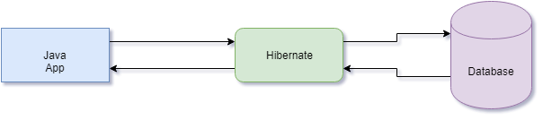
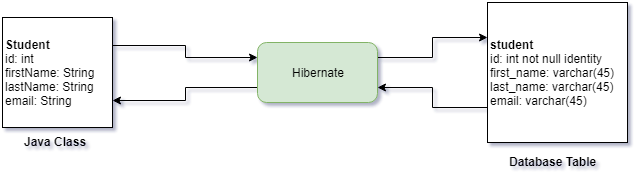

# Hibernate Introduction

<!-- TOC -->

- [Hibernate Introduction](#hibernate-introduction)
  - [Overview](#overview)
  - [Saving an Object via Hibernate](#saving-an-object-via-hibernate)
  - [Retrieving an Object via Hibernate](#retrieving-an-object-via-hibernate)
  - [Querying with Hibernate](#querying-with-hibernate)
  - [Relationship Between Hibernate and JDBC](#relationship-between-hibernate-and-jdbc)

<!-- /TOC -->

## Overview

- Hibernate is a framework for persisting Java objects into a database.



- Hibernate handles all of the low-level SQL code for you.
- Minimizes the amount of JDBC code you have to write.
- Hibernate creates the Object-to-Relational Mapping (ORM).
  - You can configure this via configuration files or annotations.



## Saving an Object via Hibernate

- The most basic example of saving, via Hibernate, is to use the `session.save()` method.

```java
// create java object
Student student = new Student("John", "Doe", "johndoe@gmail.com");

// store it in the database
int studentId = (Integer) session.save(student); // we return the id in case we want to use it later
```

## Retrieving an Object via Hibernate

- Again, a simple example to get an object from the database, via the `session.get()` method.

```java
// retrieve via primary key
Student johnStudent = session.get(Student.class, studentId);
```

## Querying with Hibernate

- Hibernate does allow you to query data via the `createQuery()` method, and the resulting `Query` object.
- On the query object, just call the `list()` method.
- This uses the Hibernate Query Language.

```java
Query query = session.createQuery("from students");

List<Student> students = query.list();
```

## Relationship Between Hibernate and JDBC

- Hibernate creates a layer of abstraction over the top of JDBC.
- Everything Hibernate does still goes through the JDBC.
- So, Hibernate essentially just makes it easier to work with JDBC.
