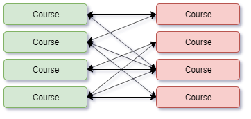

# Hibernate Advanced Mapping

<!-- TOC -->

- [Hibernate Advanced Mapping](#hibernate-advanced-mapping)
  - [Overview](#overview)
  - [Entity Lifecycle](#entity-lifecycle)
  - [Relationships](#relationships)
    - [One to One Mapping](#one-to-one-mapping)
      - [Development Process](#development-process)
      - [One To One Unidirectional](#one-to-one-unidirectional)
      - [One to One Bidirectional](#one-to-one-bidirectional)
    - [One To Many Mapping](#one-to-many-mapping)
      - [One To Many Bidirectional](#one-to-many-bidirectional)
      - [One to Many Unidirectional](#one-to-many-unidirectional)
    - [Many to One Mapping](#many-to-one-mapping)
    - [Many to Many Mapping](#many-to-many-mapping)
  - [Database Setup](#database-setup)
    - [Primary and Foreign Keys](#primary-and-foreign-keys)
    - [Cascading](#cascading)
      - [Configuring Cascade Type](#configuring-cascade-type)
    - [Fetch Type](#fetch-type)
      - [Lazy Loading](#lazy-loading)
    - [Directionality](#directionality)

<!-- /TOC -->

## Overview

- Hibernate has more advanced features for managing data, beyond the basic CRUD operations.
- Advanced mapping includes things like defining relationships between entities, building co-retrieval processes for related entities, joining tables, etc.
- The advanced annotations are:
  - `@OneToOne`
  - `@OneToMany`
  - `@ManyToOne`
  - `@ManyToMany`
- To take advantage of these capabilities, the database needs to use primary and foreign keys.

## Entity Lifecycle

- Entities have a number of states they move through in the Hibernate workflow.

| Operation | Description                                                                         |
| --------- | ----------------------------------------------------------------------------------- |
| Detach    | Entity not associated with a hibernate session.                                     |
| Merge     | Attaches an entity to a hibernate session.                                          |
| Persist   | Transitions entity to a managed state. Next flush/commit will save to the database. |
| Remove    | Removes a managed entity from the database on the next flush/commit.                |
| Refresh   | Reloads the entity from the database to make sure state isn't stale.                |


## Relationships

### One to One Mapping

- One to one means the left-hand and right-hand entities are related exclusively to one another.
  - An Instructor has an Instructor Detail.
  - The Instructor does not have more than one Instructor Detail.
  - The Instructor Detail does not belong to any other Instructor.


#### Development Process

1. Define database tables and setting up table relationships.
2. Create entity classes.
3. Add relational annotations for `@OneToOne` and `@JoinColumn`.
4. Use the entities.

#### One To One Unidirectional

- Add the `@OneToOne` annotation to the foreign key field in the primary entity.
- Add the `@JoinColumn` annotation to the foreign key field of the primary entity, and give it the `name` of the foreign key column.

```java
// note: the instructor detail entity looks no different from a normal hibernate entity. Since this is unidirectional, it has no new annotations--those are all handled in the instructor, below.

// instructor entity
@Entity
@Table(name = "instructor")
public class Instructor {

  @Id
  @GeneratedValue(strategy = GenerationType.IDENTITY)
  @Column(name = "id")
  private int id;

  @Column(name = "first_name")
  private String firstName;

  @Column(name = "last_name")
  private String lastName;

  @Column(name = "email")
  private String email;

  @OneToOne(cascade = CascadeType.ALL)
  @JoinColumn(name = "instructor_detail_id") // points to the column in the instructor table that is a foreign key, as defined in the database schema
  private InstructorDetail instructorDetail;

  public Instructor() {}

  /**
   * @param firstName
   * @param lastName
   * @param email
   */
  public Instructor( String firstName, String lastName, String email ) {
    this.firstName = firstName;
    this.lastName = lastName;
    this.email = email;
  }

  // more code

}

```

- Since cascade is set to all, you only have to associate the entities in the Java code. Then, doing something to the instructor will do the same to the other.

```java
public class CreateDemo {

  public static void main(String[] args) {

    // create session factory
    SessionFactory factory = new Configuration()
      .configure("hibernate.cfg.xml")
      .addAnnotatedClass(Instructor.class) // note that we add all of the necessary managed classes here by stringing multiple instances of the addAnnotatedClass
      .addAnnotatedClass(InstructorDetail.class)
      .buildSessionFactory();

    // create session
    Session session = factory.getCurrentSession();

    // use session
    try {

      // create objects
      Instructor instructor = new Instructor("Chad", "Darby", "darby@luv2code.com");

      InstructorDetail instructorDetail = new InstructorDetail("https://luv2code.come/youtube", "writing code");

      // relate the objects

      instructor.setInstructorDetail( instructorDetail );

      System.out.println( "Instructor and details created:" + instructor );

      // start transaction

      session.beginTransaction();

      // save objects

      System.out.println( "Saving the instructor..." );
      System.out.println( "Cascade Type == ALL." );
      System.out.println( "Saving instructor details..." );
      session.save(instructor);

      // commit transaction

      session.getTransaction().commit();
      System.out.println( "Instructor and details saved..." );

    } catch(Exception e) {

      e.printStackTrace();

    } finally {

      // close session
      session.close();

      // close factory
      factory.close();
      System.out.println("Session closed...");

    }

  }

}

```

#### One to One Bidirectional

- If we want to be able to load either entity in a relationship and pull the other, we need to set up a bidirectional relationship.
  - Basically, you'll just configure both sides of the relationship with the `@OneToOne` annotation.
  - However, with the entity that _does not_ define the relationship, you'll use the `mappedBy` property on the `@OneToOne` annotation.
  - `mappedBy` identifies the _Java field_ in the defining entity that establishes the relationship between the two.
- You can also define cascade separately on the secondary entity.

```java
@Entity
@Table(name = "instructor_detail")
public InstructorDetail {

  @OneToOne(mappedBy = "instructorDetail", // points to the Instructor.instructorDetail field
            cascade = CascadeType.ALL) // set up the cascade type on this guy too.
  private Instructor instructor;

}
```

### One To Many Mapping

- One to many means the left-hand entity can be related to multiple of the right-hand entity.
  - An Instructor can have multiple Courses.
  - The Instructor is not limited to one Course.
  - Each Course can only have one Instructor, though.


#### One To Many Bidirectional

- Not sure if you can go each way, but choose one of your entities to own the relationship.
- On this entity, add the `@OneToMany` or `@ManyToOne` annotation, depending on how their side of the relationship looks.
- Configure their `@JoinColumn` and cascading.
- Now, on the other entity--the related one--add a field to capture the relationship.
- Annotate this field with the `@OneToMany` or `@ManyToOne` annotation, depending on their side.
- Add the `mappedBy` property to this annotation, and point it at the defining field on the other entity.
- Configure your cascading.
- Now, on your session factory, make sure you've added _all_ of the related classes as separate calls to the `addAnnotatedClass`.

```java
// course defines the relationship
@Entity
@Table(name = "course")
public class Course {

  // more code

  @ManyToOne(cascade = {
    CascadeType.PERSIST,
    CascadeType.REFRESH,
    CascadeType.MERGE,
    CascadeType.DETACH
  })
  @JoinColumn(name = "instructor_id")
  private Instructor instructor;

  // more code
}

// instructor
@Entity
@Table(name = "instructor")
public class Instructor {

  // code

  @OneToMany(mappedBy = 'instructor',
            cascade = {
              CascadeType.PERSIST,
              CascadeType.REFRESH,
              CascadeType.MERGE,
              CascadeType.DETACH,
            })
  private List<Course> courses;

  // more code
}

// main application
public static void main(String[] args) {

  SessionFactory factory = new Configuration()
                              .configure("hibernate.cfg.xml")
                              .addAnnotatedClass( Instructor.class ) // list each related class
                              .addAnnotatedClass( InstructorDetail.class )
                              .addAnnotatedClass( Course.class )
                              .buildSessionFactory();

  // more code

}

```

#### One to Many Unidirectional

### Many to One Mapping

- Many to one means the left-hand entity can be related to one right-hand entity, but the right-hand entity can be related to multiple left-hand entities.
  - It's the One to Many relationship, just coming from the other perspective.
  - A Course can have only one Instructor, but multiple Courses could have the same Instructor.


- Because `@OneToMany` and `@ManyToOne` are interrelated, I've placed the `@ManyToOne` examples in the [`@OneToMany` section](#one-to-many-mapping).

### Many to Many Mapping

- Many to many means both sides of the relationship can have multiple of their inverse.
  - A Student can have multiple Courses.
  - Each Course can have multiple Students.



## Database Setup

### Primary and Foreign Keys

- Primary uniquely identify a row in a table.
- Foreign keys link one table to another.
  - A foreign key in Table A links to the primary key in Table B.

### Cascading

- Cascading means applying the same operation to related entities.
  - For example, if you save Instructor, it can cascade that operation and save the related Instructor Detail.
  - Similarly, deleting an Instructor deletes the related Instructor Detail.
    - This is called a CASCADE DELETE
- Hibernate allows us to configure cascade.
  - By default, no cascading is applied.

| Type    | Description                                                   |
| ------- | ------------------------------------------------------------- |
| Persist | Related entities are saved together.                          |
| Remove  | Related entities are deleted together.                        |
| Refresh | Related entities are refreshed from the database together     |
| Detach  | Related entities are removed from the managed state together. |
| Merge   | Related entities are added to the managed state together.     |
| All     | All cascade operations apply to the related entities.         |

#### Configuring Cascade Type

- Add the `(cascade = CascadeType.X)` to the mapping annotation.

```java
@OneToOne(cascade = CascadeType.ALL)
@JoinColumn(name = "instructor_detail_id")
private InstructorDetail instructorDetail;
```

- You can specify multiple cascade types by using a comma-dilimted list.

```java
@OneToOne(cascade = {
  CascadeType.MERGE,
  CascadeType.REMOVE,
  CascadeType.REFRESH
})
@JoinColumn(name = "instructor_detail_id")
private InstructorDetail instructorDetail;
```

### Fetch Type

- Fetch Type is about retrieving data that has related entities.
  - "If we retrieve an Instructor", Fetch Type asks, "should we also retrieve the Instructor Detail?"
- `LAZY` retrieves only what's requested.
- `EAGER` retrieves everything related to the retrieved entity.
- The best practice in software development is to only load data when it's needed.
  - Prefer LAZY loading over EAGER in most scenarios!

```java
// lazy
@OneToMany(fetch = FetchType.LAZY, mappedBy = "instructor")
private List<Course> courses;

// eager
@ManyToOne(fetch = FetchType.EAGER, cascade = {
  CascadeType.DETACH,
  CascadeType.MERGE,
  CascadeType.PERSIST,
  CascadeType.REFRESH
})
@JoinColumn(name = "instructor_id")
private List<Course> courses;
```

- Each relational annotation has its own default fetch type:

| Annotation  | Fetch Type |
| ----------- | ---------- |
| @OneToOne   | EAGER      |
| @OneToMany  | LAZY       |
| @ManyToOne  | EAGER      |
| @ManyToMany | LAZY       |

#### Lazy Loading

- In lazy loading, the primary entity is retrieved, and related entities are only retrieved on demand.
- However, this "on-demand" loading requires an open Hibernate session.
  - If the session is closed and you try to retrieve the lazy data, you'll get an exception.
- You can retrieve lazy data using both the `session.get()` and HQL techniques.

### Directionality

- In loading, there's a concept called directionality.
- Unidirectional
  - In unidirectional, the relationship is defined one way.
  - Loading the owner entity loads the other.
- Bidirectional
  - In bidirectional, the relationship flows both ways.
  - Loading either entity loads the other.
