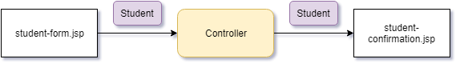

# Spring Forms

## Overview

- Spring allows you to use Form Tags to automatically bind data from forms to Java objects.
  - The Controller creates an object for the data to populate.
  - The form uses the model to pre-populate any values that are available via the object getter methods.
  - Submitting the form calls the setter methods and populates the object.



- [Official docs](https://docs.spring.io/spring/docs/3.2.x/spring-framework-reference/html/view.html)

## Getting Started

- You need to add a model attribute to your Spring Controller.
  - This provides a place for the data to bind to.
- These form tags seem to require JSP view layer.
- To get them working, you have to add a tag to the beginning of your JSP.

```html
<%@ taglib prefix="form" uri="http://www.springframework.org/tags/form" %>
```

- Then, you just use them in place of normal HTML within your document.
  - The

### Development Process

- Create the necessary containing objects.
  - In our example, this is the `Student` object.
- Create the Controller.
  - Make sure to return a model of the `Student` object, so the form can bind to something.
- Create the form.
  - Bind the object to the form inputs.
  - Use the Spring form binding processes.
  - For the form, make sure the `modelAttribute` attribute is set to the name of your Object-containing attribute on the model--`student`.
  - For each input, the `path` attribute should match the name of the field on the object.
- Create the form processing methods.
- Create the confirmation page.
  - Use the `@ModelAttribute` to bind the data to the `Student` object.

#### Example

- Student

```java
public class Student {

  private String firstName;
  private String lastName;

  public Student() {}

  public String getFullName() {
    return this.getFirstName() + " " + this.getLastName();
  }

  public String getFirstName() {
    return firstName;
  }

  public void setFirstName(String firstName) {
    this.firstName = firstName;
  }

  public String getLastName() {
    return lastName;
  }

  public void setLastName(String lastName) {
    this.lastName = lastName;
  }

}

```

- StudentController

```java
@Controller
@RequestMapping("/student")
public class StudentController {

  @RequestMapping("/register")
  public String showRegisterForm(Model model) {
    // create date
    SimpleDateFormat dateFormatter = new SimpleDateFormat("EEE, MMM dd, YYYY");
    Date todayDate = new Date();

    // create Student
    Student student = new Student();

    // add to model
    model.addAttribute("todayDate", dateFormatter.format(todayDate));
    model.addAttribute("student", student);

    return "registration";
  }

  @RequestMapping("/confirmation")
  public String showConfirmation(
    @ModelAttribute("student") Student student, // binds to the Student object
    Model model
  ) {
    System.out.println("Student: " + student.getFullName());
    return "confirmation";
  }
}
```

- registration.jsp

```html
<%@ page language="java" contentType="text/html; charset=ISO-8859-1"
pageEncoding="ISO-8859-1"%> <%@ taglib prefix="form"
uri="http://www.springframework.org/tags/form" %>
<!DOCTYPE html>
<body>
  <head>
    <meta charset="ISO-8859-1" />
    <title>Super University - Student Registration</title>
  </head>
  <body>
    <h1>Super University</h1>
    <h2>Student Registration Form</h2>
    <p>${todayDate}</p>
    <form:form action="confirmation" modelAttribute="student">
      <label for="firstName">First Name: </label>
      <form:input path="firstName" />
      <label for="lastName">Last Name: </label>
      <form:input path="lastName" />
      <input type="submit" value="Register" />
    </form:form>
  </body>
</body>
```

- confirmation.jsp

```html
<%@ page language="java" contentType="text/html; charset=ISO-8859-1"
pageEncoding="ISO-8859-1"%>
<!DOCTYPE html>
<html>
  <head>
    <meta charset="ISO-8859-1" />
    <title>Super University - Registration Confirmation</title>
  </head>
  <body>
    <h1>Super University</h1>
    <h2>Registration Confirmed!</h2>
    <p>Welcome aboard ${student.firstName} ${student.lastName}!</p>
  </body>
</html>
```

### Drop-Downs

- You can use the form tag `<form:select>` for drop-down lists.
- You can load the values of the drop-down in three ways:
  - Directly in the HTML by adding mulitple `<form:option>` tags nested in the `<form:select>`.
  - By creating a data-binding with a property on the object--the `Student` object, in this case.
    - The property would be, for example, a linked list, and you'd iterate through that list when populating the value.
    - You can iterate through by nesting the `<form:options items="${student.countryOptions}" />` inside the `<form:select>`.
  - Loading the options into a properties file. [Instructions](https://www.udemy.com/course/spring-hibernate-tutorial/learn/lecture/5940154#overview).

```html
<!-- loaded directly in HTML -->
<form:select path="country">
  <form:option value="US" label="United States" />
  <form:option value="US" label="United States" />
  <form:option value="US" label="United States" />
</form:select>

<!-- loaded externally -->
<form:select path="country">
  <form:options items="${student.countryOptions}" />
</form:select>
```

### Radio Buttons

- Radio buttons are pretty straightforward.
- Same as select, you can also configure these to pull from a list on your class.
  - Exact same process as above.

```html
<form:radiobutton path="favoriteLanguage" value="JavaScript" />
<form:radiobutton path="favoriteLanguage" value="Java" />
<form:radiobutton path="favoriteLanguage" value="Python" />
<form:radiobutton path="favoriteLanguage" value="C#" />
```

### Checkboxes

- Checkboxes allow multiple seletions.

  - So, they have to be stored in an Array, rather than a String.
  - To display them, you also have to have the JSTL foreach tag available.
    - You get this by adding a new `taglib` value to the header of your HTML.
      - Note, you can give the tag whatever prefix you want, apparently. That's cool.

- Form HTML

```html
<form:checkbox path="operatingSystem" value="Linux" />Linux
<form:checkbox path="operatingSystem" value="Linux" />MacOS
<form:checkbox path="operatingSystem" value="Linux" />Windows
```

- Outcome HTML

```html
<%@ taglib uri="http://java.sun.com/jsp/jstl/core" prefix="c" %>
<!-- some time later -->
<p>Operating systems:</p>
<ul>
  <c:forEach var="item" items="${student.operatingSystems}">
    <li>${item}</li>
  </c:forEach>
</ul>
```
