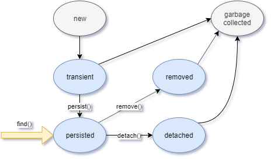

# Java Persistence API

- Java Persistence API (JPA) allows you to interact with a database in your Java code, without explicitly writing select/insert/update queries.
  - In a sense, it allows you to say, "I want to get this Java object from the database" or "I want to save this object to the database", and then it handles translating that to SQL.
  - It does this through Object Relational Mapping (ORM), which involves mapping Java objects to their corresponding relational tables (and vice versa).
- Spring also offers some shortcuts to integrating JPA, through the Spring Data library.

## Overview

- JPA is a Java package for accessing, persisting, and managing data between Java objects and a relational database.
- JPA allows for contract free objects, defined through annotations or XML.
- JPA was inspired by Hibernate, the pioneer in Java object persistence.

## Features of JPA

- Can perform Create, Read, Update and Delete, without using SQL.
- Can manage relationships between objects.
- Can write queries using a specialized JPA query language.

## Entities

- An object that is managed by JPA is called an Entity.
- JPA offers an interface `EntityManager` for working with Entities.
- An entity is a lightweight persistence domain object.
- Typically, an entity represents a table in a relational database, and each entity instance corresponds to a row in that table.
- Entities are typically represented in Java as entity classes, though they can be helper classes too.
- The persistent state of an entity is represented through either persistent fields or persistent properties.
  - These fields or properties use object/relational mapping annotations to map the entities and entity relationships to the relational data in the underlying data store.

### Entity Requirements

- For a class to be an entity class, it must meet the following requirements:
  - Use the `javax.persistence.Entity` annotation.
  - Must have a public or protected constructor that takes no arguments.
  - It must not be final or have any final methods or fields.
  - All fields must be private, protected, or package-private.

### Persistence Fields

- Anything not annotated `Transient` or marked transient by Java will be persisted to the database.
- Object/relational mapping annotations must be applied to instance variables.

### Primary Keys

- Each entity must have a primary key.
- The primary key allows the persistence API to identify a particular instance of an entity.
- Primary keys can be simple or composite.
  - A simple key is annotated with `javax.persistence.Id`.
- Primary keys can only be applied to a field that contains a Java primitive type or Java primitive wrapper:
  - java.lang.String
  - java.util.Date
  - java.sql.Date
  - java.math.BigDecimal
  - java.math.BigInteger
- Primary keys can be auto-generated via the `AutoGenerated` annotation.
  - There are four types of supported auto-generation:
    - AUTO (default)
      - For the default generation type, the persistence provider will determine values based on the type of the primary key attribute.
      - For numeric values, the generation is based on a sequence or table generator.
      - In this case, the primary key values will be unique at the database level.
    - IDENTITY
      - Expects the corresponding database column to be set to IDENTITY and AUTO_INCREMENT.
    - SEQUENCE
      - This generator uses sequences if supported by the database or switches to table generation if it doesn’t.
      - To customize the sequence name, we can use the `@GenericGenerator` annotation with `SequenceStyleGenerator` strategy.
      - This one is quite a bit different from the options above. It requires a few more configurations, and doesn't use `@AutoGenerated`.
      - The generated values are unique per sequence.
      - If a sequence name is not specified, Hibernate will re-use the same hibernate_sequence for different types.
    - TABLE
      - The `TableGenerator` uses an underlying database table that holds segments of identifier generation values.

```java
// AUTO
@Entity
public class MyFirstEntity {

  @Id
  @AutoGenerated
  private Long id;

}

// IDENTITY
@Entity
public class MyFirstEntity {

  @Id
  @GeneratedValue(strategy = GenerationType.IDENTITY)
  private Long id;

}

// SEQUENCE
@Entity
public class MyFirstEntity {

  @Id
  @GeneratedValue(generator = "sequence-generator")
  @GenericGenerator(
    name: "sequence-generator",
    strategy = "org.hibernate.id.enhanced.SequenceStyleGenerator",
    parameters = {
      @Parameter(name = "sequence_name", value = "user_sequence"),
      @Parameter(name = "initial_value", value = "4"),
      @Parameter(name = "increment_size", value = "1")
    }
  )
  private Long id;

}

// TABLE
@Entity
public class MyFirstEntity {

  @Id
  @GeneratedValue(strategy = GenerationType.TABLE,
    generator = "table-generator")
  @TableGenerator(name = "table-generator",
    table = "dep_ids",
    pkColumnName = "seq_id",
    valueColumnName = "seq_value")
  private Long orderId;

}
```

### Specifying Table and Column Names

- There are also annotations for specifying the table and column names to which you want the Entity to match.
  - Obviously, it's the `@Table` and `@Column` annotations.

```java
@Entity
@Table(name = "my_table")
public class MyFirstEntity {

  @Id
  @GeneratedValue(strategy = GenerationType.IDENTITY)
  @Column(name = "order_id")
  private Long id;

}
```

### Entity Lifecycle

- When an entity is first created, it is transient.
  - The EntityManager is not aware of it, and if you don't do something to persist it, it gets garbase collected.
- Once it's persisted, using the EntityManager and persist method, it enters the persisted state.
  - In this state, the Entity has a linked to its cohort in the table, so any changes to the entity propogate to the entity.
- If an Entity should not be persisted, or some change to it shouldn't be, you can use the `detach()` method to detach it from the table.
- Removing an Entity from the database, using `remove()`, takes it out of the persistent state.
- The `find()` method retrieves an entity from the table, and that entity is immediately in the persisted state.



### General Process

- Create an `EntityManager` field.
- Open a connection with `begin()`.
- Do whatever you need to do.
  - Create an instance and persist it with `persist()`.
  - Load an existing Entity from the database via the `find()` method.
  - Delete one with `remove()`.
- Commit (persist) the changes with `commit()`.
- Close the transaction with `close()`.

- An example of creating an entity and persisting it.

```java
public class OrderTest {

  private static final String PERSISTENCE_UNIT_NAME = 'Order';

  private static EntityManagerFactory factory;

  public static void main(String[] args) {

    EntityManagerFactor factory = Persistence.createEntityManagerFactory(PERSISTENCE_UNIT_NAME);

    // create the entity manager
    EntityManager em = factory.createEntityManager();

    // open the transaction
    em.getTransaction().begin();

    // create the Entity instance
    Order order = new Order();
    order.setCustomerName("John Doe");
    order.setCustomerAddress("201 4th Street SW, West Bend, IA 50597");
    order.setCreatedTime(Timestamp.valueOf(LocalDateTime.now()));

    // persist the entity
    em.persist(order);
    em.getTransaction().commit();

    // close the connection
    em.close();
  }

}
```

- An example of retrieving an entity.

```java
private static void readOrder(Integer orderId, EntityManagerFactory factory) {

  EntityManager en = factory.createEntityManager();

  // retrieve the order by orderId (primary key) and create an entity for it.
  Order order = em.find(Order.class, orderId);

  System.err.println(order);

  em.close();

}
```

### Entity Relationships

- Entities can be related to other entities, just like tables can be related.
- To map the Entity relationship in JPA, you use special annotations that denote the type of relationship (one-to-one, one-to-many, many-to-many).
- One-to-one relationships use the `@OneToOne` annotation.
  - Each entity instance is related to a single instance of another entity.

```java

```

- One-to-many relationships use the `@OneToMany` annotation.
  - An entity instance can be related to multiple instances of the other entities.

```java

```

- Many-to-one relationships use the `@ManyToOne` annotation.
  - Multiple instances of an entity can be related to a single instance of the other entity.

```java

```

- Many-to-many relationships use the `@ManyToMany` annotation.
  - The entity instances can be related to multiple instances of each other.

```java
// On the books side of the relationship
@Entity
@Table(name = "books")
public class Book {
  @Id
  @GeneratedValue(strategy = GenerationType.IDENTITY)
  private Integer bookId;

  @Column(name = "title")
  private String title;

  @Column(name = "isbn")
  private String isbn;

  @ManyToMany
  @JoinTable(name = "book_author", joinColumns = @JoinColumn(name = "bookId"), inverseJoinColumns = @JoinColumn(name = "authorId"))
  private List<Author> authors;

}

// On the author side of the relationship
@Entity
@Table(name = "authors")
public class Author {

  @Id
  @GeneratedValue(strategy = GenerationType.IDENTITY)
  private Integer authorId;

  @Column(name = "name")
  private String name;

  @ManyToMany(mappedBy = "authors")
  private List<Book> books;

}
```

- With all of these annotations, you also need to specify how the tables containing the entities are related, using the `@JoinTable` annotation.

#### Relationship Direction

- The direction of a relationship can be either bidirectional or unidirectional.
- In a bidirectional relationship, each entity has a relationship field or property that refers to the other entity.
  - Bidirectional relationships have an owning and an inverse side.
  - Through the relationship field or property, an entity class’s code can access its related object.
  - If an entity has a related field, the entity is said to “know” about its related object.
  - The inverse side of a bidirectional relationship must refer to its owning side by using the `mappedBy` element of the `@OneToOne`, `@OneToMany`, or `@ManyToMany` annotation.
    - The mappedBy element designates the property or field in the entity that is the owner of the relationship.
    - Many-to-one bidirectional relationships don't require the `mappedBy` element because the many side is _always_ the owning side.
    - For one-to-one bidirectional relationships, the owning side corresponds to the side that contains the corresponding foreign key.
    - For many-to-many bidirectional relationships, either side may be the owning side.
  - In a unidirectional relationship, only one entity is aware of the other.
    - Only one entity has a field or property that identifies the relationship.

#### Relational Codepence

- Sometimes, relationships are codependent.
  - For example, an OrderItem can't exist without an Order.
- It makes sense that such entities persist together.
- JPA offers methods of persisting codependent entities together, with one persist command.

##### Cascading

- This is called cascading.
- To use cascading, use the `CascadeType` of the persistence api.
  - The `CascadeType` has a number of settings;
    - ALL
      - Executes all of the other cascade processes (DETACH, MERGE, PERSIST, REFRESH, REMOVE).
    - DETACH
      - If the parent entity is detached from the persistence context, the related entity will detach as well.
    - MERGE
      - If the parent entity is merged into the persistence context, the related entity will merge as well.
    - PERSIST
      - If the parent entity is persisted in the persistence context, the related entity will persist as well.
    - REFRESH
      - If the parent entity is refreshed in the persistence context, the related entity will be refreshed as well.
    - REMOVE
      - If the parent entity is removed from the persistence context, the related entity will be removed as well.
      - This is apparently used for the delete operation.
      - When REMOVE is used, orphans can remain. To remove orphans, use the `orphanRemoval="true"` option

```java
@OneToMany(cascade = REMOVE, mappedBy = "customer", orphanRemoval = "true")
public Set<Order> getOrders() {
  return orders;
}
```

#### Fetching

- Just like you can couple items for cascading, you can also couple them for retrieval.
  - For example, you can set your application to retrieve all related OrderItems when you retrieve their parent Order.
- This is done via the `FetchType` option.
- By default, `FetchType` is set to LAZY.
- Setting `FetchType to EAGER makes it always return the related entity.

## Getting Started with JPA

- Configure your pom file with necessary dependencies.
  - mysql-connector-java
  - javax.persistence-api
  - hibernate-core
  - jaxb-api
- Create a `persistence.xml` file and add it to the classpath.
  - In the file, you'll define your connection variables and identify your entities.
  - Here's a [good resource](https://thoughts-on-java.org/jpa-persistence-xml/) on configuring the `persistence.xml`, with information on each element, and other configuration settings you can use.

```xml
<?xml version="1.0" encoding="UTF-8"?>
<persistence version="2.1"
    xmlns="http://xmlns.jcp.org/xml/ns/persistence" xmlns:xsi="http://www.w3.org/2001/XMLSchema-instance"
    xsi:schemaLocation="http://xmlns.jcp.org/xml/ns/persistence http://xmlns.jcp.org/xml/ns/persistence/persistence_2_1.xsd">
  <persistence-unit name="TestPersistence" transaction-type="RESOURCE_LOCAL">
    <class><!-- Entity Manager Class Name, fully qualified --></class>
    <propert  ies>
      <property name="javax.persistence.jdbc.driver" value="Database Driver Name" />
      <property name="javax.persistence.jdbc.url" value="Database Url" />
      <property name="javax.persistence.jdbc.user" value="Database Username" />
      <property name="javax.persistence.jdbc.password" value="Database Password" />
    </properties>
  </persistence-unit>
</persistence>
```

- Create a `hibernate.properties` file.
  - Here's another example:

```text
hibernate.bytecode.use_reflection_optimizer=false
hibernate.connection.driver_class=com.mysql.jdbc.Driver
hibernate.connection.url=jdbc:mysql://localhost/jdndc3
hibernate.connection.username=root
hibernate.connection.password=u8nIs42UCfGWqk9p2IA4
hibernate.dialect=org.hibernate.dialect.MySQLDialect
show_sql=true
format_sql=true
use_sql_comments=true
```

- Build your entity class(es).
- Build your calling classes.
  - These should use the `EntityManagerFactory` and `EntityManager` classes.
