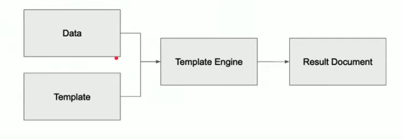

# Java Spring Boot Templating

- [Java Spring Boot Templating](#java-spring-boot-templating)
  - [Overview](#overview)
    - [What is a Template Engine?](#what-is-a-template-engine)
  - [Freemarker](#freemarker)
    - [Configure Spring Boot to Use Freemarker](#configure-spring-boot-to-use-freemarker)
    - [Resources](#resources)
  - [Thymeleaf](#thymeleaf)
    - [Adding Thymeleaf to Spring Boot](#adding-thymeleaf-to-spring-boot)
    - [Using Thymeleaf](#using-thymeleaf)
      - [Variable Output](#variable-output)
      - [Conditions](#conditions)
      - [Loops](#loops)
      - [Example](#example)
    - [Resources](#resources-1)

## Overview

- Spring Boot has three major templating engines:
  - Freemarker
  - JSP
  - Thymeleaf

### What is a Template Engine?

- It combines source templates with data to produce dynamically rendered documents.
- It provides rendering for server-side code processes.
  - It's just templating, dude. Same as pug or whatever.
- Templating includes the following components:
  - Data model
    - Any datasource (database, xml, csv, etc)
  - Source template
    - Any file types to be rendered and populated by the template engine.
    - HTML, XML, etc.
  - Template engine
    - The process that connects the data model to the source template.
    - Outputs the result document, or the populated HTML, in this case.



## Freemarker

- FreeMarker works as a sequential text processor, which differs from how some template engines work.
  - Not sure how it works because the Udacity demo code is invalid. Super good job. Super good.

### Configure Spring Boot to Use Freemarker

- Just import the Freemarker dependency when using the Spring Initializr.

### Resources

- [Freemarker Website](https://freemarker.apache.org/)

## Thymeleaf

- Thymeleaf is a common templating engine.
- It's easier to use than Freemarker.
- It's very similar to pug, injecting data into the DOM using specialized tag attributes.

### Adding Thymeleaf to Spring Boot

- You can add Thymeleaf as a dependency using the Spring Initializr.

### Using Thymeleaf

- Add your templates to the resources/templates folder.
- In the template, you can use the specialized syntax to bind a data element, which renders when the app loads.

#### Variable Output

#### Conditions

#### Loops

#### Example

- Create a controller class to handle the data.
- This example creates a `UserController` that maps to the /demo route.
- This model has a single attribute--message.
  - We'll see this used in the template.

```java
package com.technakal.thymeleafpractice.Controller;

import org.springframework.stereotype.Controller;
import org.springframework.ui.Model;
import org.springframework.web.bind.annotation.RequestMapping;

@Controller
public class UserController {
  @RequestMapping("demo")
  public String demo(Model model) {
    model.addAttribute("message", "Hello Thymeleaf");
    return "demo";
  }
}
```

- Create a template in the `resources/template`.
- This template renders the `message`. That's all it does.
  - You need to add the `xmlns:th="http://www.w3.org/1999/xhtml"` value to the <html> tag.
    - This tells the HTML that it should be rendered using Thymeleaf.
  - The <span> has a `th:text` attribute that points to the `${message}` value.
  - This tells Thymeleaf to render the demo model's message value when the page is accessed.

```html
<!DOCTYPE html>
<html>
  <head lang="en" xmlns:th="http://www.w3.org/1999/xhtml">
    >
    <meta charset="utf-8" />
    <title>Thymeleaf Demo</title>
  </head>
  <body>
    <span th:text="${message}"></span>
  </body>
</html>
```

### Resources

- [Thymeleaf](https://www.thymeleaf.org/)
