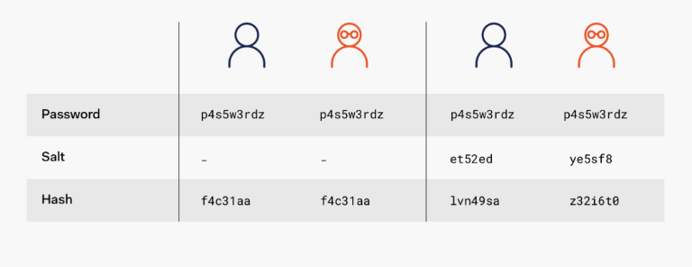

# Authentication and Authorization

## Authentication

- Authentication is the process of proving that the user is who they say they are.
- There are many types of authentication, including:
  - Password authentication
  - Token authentication
    - Something the user has.
    - Can be physical, but something like JWT also counts.
  - Biometric authentication
  - Time-based authentication
    - Expiring codes that the user has to enter.
    - These change frequently.
    - Think of the 1Password 2FA option.

### Hashing

- Hashing is the process of running a password through a function that is nearly irreversible to create a new version of the password.
- Hashing uses algorithms that are nearly irreversible--so someone starting with the hashed password can't guess the original password.
  - It's like taking fruit and running it through a blender. You can't turn the juice back into the fruit.
- A good hash function is efficient, uniform, and unpredictable.
  - Unpredictable just means that the hash of "bat" should have nothing in common with the hash of "cat".
- MD5 is bad. SHA-1 is bad.
- bcrypt, scrypt, and PBKDF2 are good.

### Salting

- A salt is cryptographically-strong random value that is added to the input of a hash function.
  - It ensures that all hashes are unique.
- Salting is the process of adding some unpredictable (and invisible to the user) data into a password, so that the hashed result is even more random and complicated to reverse.
- Salting is one more layer on top of hashing.
- In a theoretical situation, two users with the same password would end up with the same hashed password. However, with salting, their hashed passwords will no longer be distinct.

### Resources

- [OWASP authentication cheatsheet](https://github.com/OWASP/CheatSheetSeries/blob/master/cheatsheets/Authentication_Cheat_Sheet.md)
- [Encryption, hashing, and salting overview](https://www.thesslstore.com/blog/difference-encryption-hashing-salting/)
- [Hashing](https://medium.com/tech-tales/what-is-hashing-6edba0ebfa67)
- [Salting](https://auth0.com/blog/adding-salt-to-hashing-a-better-way-to-store-passwords/)

## Authorization

- Determining what the user has the permission to do.
- Usually handled by role-based access control (RBAC).
  - So, an individual user doesn't have explicit access.
  - Instead, they have a role, and access is controlled by that role.
- Authorization requires authentication.
