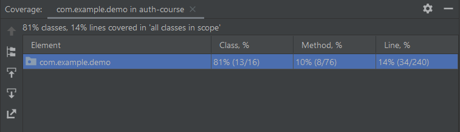
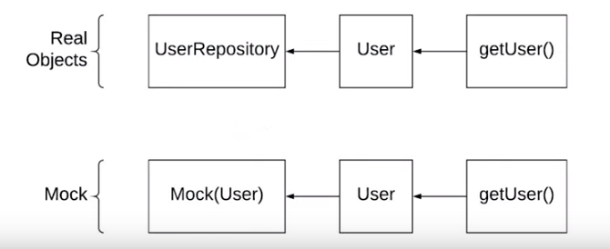

# Unit Testing with JUnit

## Basics

- Annotate tests with `@Test`.
- Assertion methods test your outcomes.
  - Here's a [full list](http://junit.sourceforge.net/javadoc/org/junit/Assert.html) of assertion methods.

```java
package com.udacity.examples.Testing;

import org.junit.jupiter.api.Test;

import java.util.Arrays;
import java.util.IntSummaryStatistics;
import java.util.List;

import static org.junit.jupiter.api.Assertions.assertEquals;

public class HelperTest {

  @Test
  public void verify_testLoads(){
  }

  @Test
  public void verify_getCount() {
    List<String> names = Arrays.asList("Noel", "Kenzie", "", "Brant");
    long actualCount = Helper.getCount(names);
    long expectedCount = 1;
    assertEquals(expectedCount, actualCount);
  }

  @Test
  public void verify_getStats() {
    List<Integer> ints = Arrays.asList(98, 75, 99, 87, 100);
    IntSummaryStatistics stats = Helper.getStats(ints);
    assertEquals(100, stats.getMax());
  }

  @Test
  public void verify_getMergedList() {
    List<String> names = Arrays.asList("Noel", "Mackenzie");
    String expected = "Noel, Mackenzie";
    String actual = Helper.getMergedList(names);
    assertEquals(expected, actual);
  }
}
```

## More Advanced Features

- These features are all JUnit 4. I'm sure there are comparable ones in JUnit 5, but I'm not sure what they are.

### Before and After Tests

- `@Before` runs before each test.
  - Useful for repeated setup activities.
  - This can be used to prep the environment, print startup messages, etc.
- `@BeforeClass` runs once before the entire test class.
  - Must be `static` and `void`.
- `@After` runs after each test.
  - Useful for repeated teardown activities.
- `@AfterClass` runs once after the entire test class.
  - Must be `static` and `void`.
- `@Ignore` skips a test case.
  - Can be useful for resource-intensive tests.

### Parameterized Tests

- Parameterized tests allow you to run the same tests with different inputs.
  - Requires the `@RunWith(Parameterized.class)` annotation.
  - Requires you to set up your parameters with a `@Parameters` method.

```java
package com.udacity.examples.Testing;

import org.junit.Assert;
import org.junit.Test;
import org.junit.runner.RunWith;
import org.junit.runners.Parameterized;
import org.junit.runners.Parameterized.*;

import java.util.Arrays;
import java.util.Collection;

import static org.junit.Assert.assertNotEquals;

@RunWith(Parameterized.class)
public class HelperParameterizedTest {

  private String input;
  private String output;

  public HelperParameterizedTest(String input, String output) {
    super();
    this.input = input;
    this.output = output;
  }

  @Parameters
  public static Collection initData() {
    String empName[][] = {{"Noel", "Noel"}, {"Noel", "Jeff"}};
    return Arrays.asList(empName);
  }

  @Test
  public void verify_input_names_not_equal_to_output_names() {
    assertNotEquals(input, output);
  }

}
```

## Code Coverage

- This is a measure of the percentage of code you have tests for.
  - 80% is a standard value to aim for.
- IntelliJ can automatically calculate your code coverage on the class, method, and line levels.
  - Just right click on your test folder and select "Run Tests in \${x} with Coverage."
  - IntelliJ will open a panel on the side that provides code coverage percentages and statistics.



## Mocks

- Sometimes, we want to test our code, but it is impractical or impossible to work with real objects.
- In these cases, we use Mocks, or mock objects, that simulate the behavior of the real objects.
  - This allows us to test them.
- Mockito is a framework for mock testing.



### Creating Mocks with Mockito

- Requires JUnit and Mockito dependencies.
  - Spring Test comes with JUnit 4.12 and Mockito 2.23.
- It can be helpful to create a helper test class that allows us to easily inject objects into our tests.
  - This class takes an object to be acted upon, the field we want to change in that object, and the value we want to replace that field with.
  - This class takes an object and replaces the designated field value with the injected object.
  - Create a TestUtils class, like the following:

```java
public class TestUtils {

    public static void injectObject(Object target, String fieldName, Object toInject) {

        boolean wasPrivate = false;

        try {
            Field declaredField = target.getClass().getDeclaredField(fieldName);
            if(!declaredField.isAccessible()) {
                declaredField.setAccessible(true);
                wasPrivate = true;
            }
            declaredField.set(target, toInject);
            if(wasPrivate) {
                declaredField.setAccessible(false);
            }
        } catch (NoSuchFieldException e) {
            e.printStackTrace();
        } catch (IllegalAccessException e) {
            e.printStackTrace();
        }

    }
}
```

- In use, this would be called like this:

```java
TestUtils.injectObject(objectToChange, "objectRepository", testRepository);
```

- This would result in the `objectRepository` on the `objectToChange` being set to the `testRepository`. In this way, we can substitute our mocks for the real item.

#### Basic Testing

- With Mockito, you can substitute real objects for mock objects.
- Below, we're testing our `UserController` class.
  - We're mocking our `UserRepository`, `CartRepository`, and `BCryptPasswordEncoder` via the `mock()` method.
    - These are required fields in `UserController`, so we need them for the tests to work.
  - Then, `@Before` each test, we replace the real articles with the mocks, using our `TestUtils.injectObject` method.
  - In our `happy_path` test, we create a user request, get the response from the controller, and run tests on the response and its contents.

```java
public class UserControllerTest {

  // create our required fields and mock those we want to mock
  private UserController testUserController;
  private UserRepository testUserRepository = mock(UserRepository.class);
  private CartRepository testCartRepository = mock(CartRepository.class);
  private BCryptPasswordEncoder testBCryptEncoder = mock(BCryptPasswordEncoder.class);


  // replace the real article with mock objects
  @Before
  public void setup() {
    testUserController = new UserController();
    TestUtils.injectObject(testUserController, "userRepository", testUserRepository);
    TestUtils.injectObject(testUserController, "cartRepository", testCartRepository);
    TestUtils.injectObject(testUserController, "bCryptPasswordEncoder", testBCryptEncoder);
  }

  @Test
  public void create_user_happy_path() throws Exception {
    // create the mocked user request
    CreateUserRequest userRequest = new CreateUserRequest();
    userRequest.setUsername("test_user");
    userRequest.setPassword("test_password");
    userRequest.setConfirmPassword("test_password");

    // capture the response
    final ResponseEntity<ApplicationUser> response = testUserController.createUser(userRequest);

    // test the response
    assertNotNull(response);
    assertEquals(200, response.getStatusCodeValue());

    // pull the response user from the response
    ApplicationUser user = response.getBody();

    // test that user
    assertNotNull(user);
    assertEquals(0, user.getId());
    assertEquals("test_user", user.getUsername());
    assertEquals(testBCryptEncoder.encode("test_password"), user.getPassword());
  }
}
```

#### Stubbing

- We can also intercept mid-test and replace (or stub) with our own values.
  - Basically, this allows us to preset values to whatever we want.
- Using the test we created above, we could stub our encoder to always return a certain password.
  - For example, we could say, "Any time `testBCryptEncoder.encode()` is called, just return this value."
    - In this case, below, any time our `testBCryptEncoder`'s `encode` method is called with the input of "testtest", always return the value "hashedPassword."
  - To perform stubbing, we use the `when()` method, and chain on the response action (in this case, `thenReturn()`).

```java
@Test
  public void create_user_happy_path() throws Exception {
    // stub the password encoder
    when(testBCryptEncoder.encode("testtest")).thenReturn("hashedPassword");

    // create the mocked user request
    CreateUserRequest userRequest = new CreateUserRequest();
    userRequest.setUsername("test_user");
    userRequest.setPassword("test_password");
    userRequest.setConfirmPassword("test_password");
```
